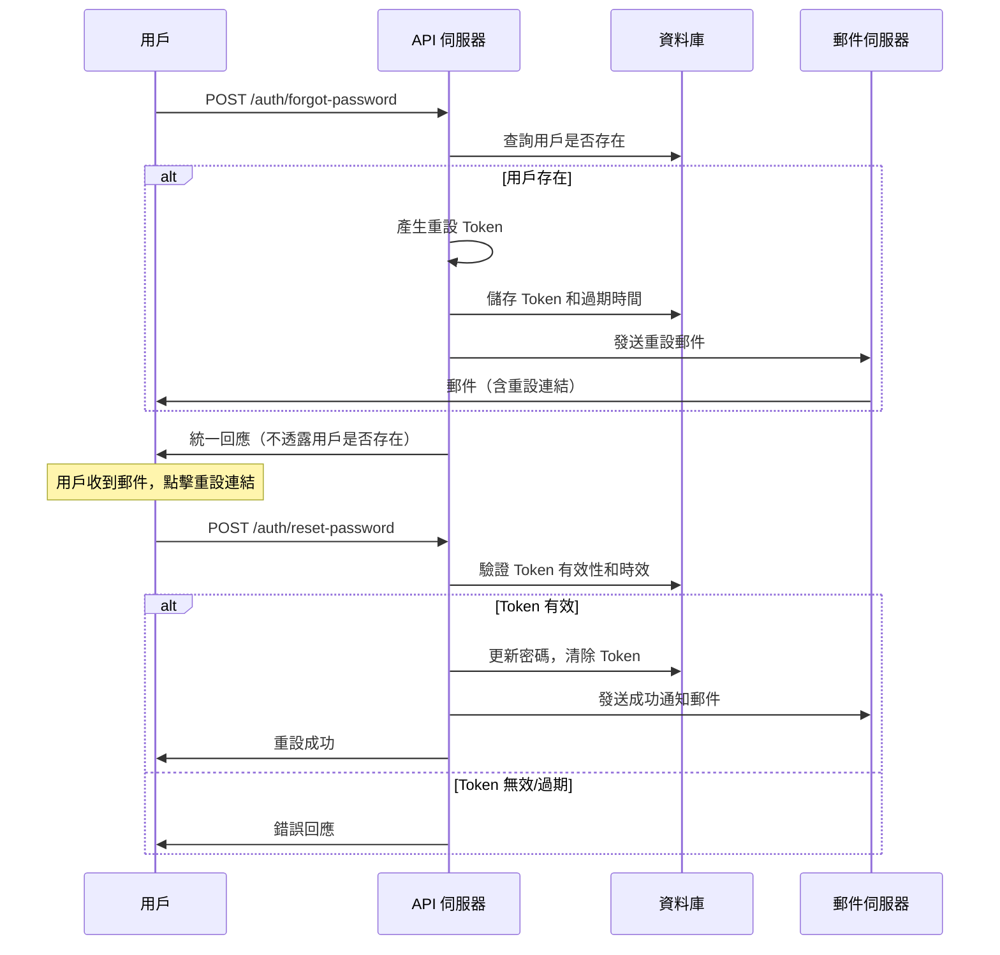

# 忘記密碼功能設定指南

## 概述

本專案實現了完整的忘記密碼功能，包括：

- 📧 發送重設密碼郵件
- 🔐 安全的重設 Token 機制
- ⏰ Token 時效控制（20 分鐘）
- 💌 美觀的 HTML 郵件模板
- 🛡️ 安全性考量（隱私保護）

## 功能流程



## 郵件設定

### 1. 更新 appsettings.json

```json
{
  "Email": {
    "SmtpHost": "smtp.gmail.com",
    "SmtpPort": "587",
    "SmtpUsername": "your-email@gmail.com",
    "SmtpPassword": "your-app-password",
    "FromEmail": "your-email@gmail.com",
    "FromName": "待辦事項系統",
    "EnableSsl": "true"
  },
  "Frontend": {
    "BaseUrl": "http://localhost:3000"
  }
}
```

### 2. Gmail 設定 (推薦)

如果使用 Gmail 作為 SMTP 伺服器：

1. **啟用兩步驟驗證**

   - 前往 Google 帳戶設定
   - 安全性 → 兩步驟驗證

2. **產生應用程式密碼**

   - Google 帳戶 → 安全性 → 應用程式密碼
   - 選擇應用程式：郵件
   - 選擇裝置：其他（自訂名稱）
   - 複製產生的 16 位數密碼

3. **更新設定**
   ```json
   {
     "Email": {
       "SmtpHost": "smtp.gmail.com",
       "SmtpPort": "587",
       "SmtpUsername": "your-gmail@gmail.com",
       "SmtpPassword": "your-16-digit-app-password",
       "FromEmail": "your-gmail@gmail.com",
       "FromName": "待辦事項系統",
       "EnableSsl": "true"
     }
   }
   ```

### 3. 其他郵件服務商設定

#### Outlook/Hotmail

```json
{
  "Email": {
    "SmtpHost": "smtp.office365.com",
    "SmtpPort": "587",
    "SmtpUsername": "your-email@outlook.com",
    "SmtpPassword": "your-password",
    "EnableSsl": "true"
  }
}
```

#### Yahoo Mail

```json
{
  "Email": {
    "SmtpHost": "smtp.mail.yahoo.com",
    "SmtpPort": "587",
    "SmtpUsername": "your-email@yahoo.com",
    "SmtpPassword": "your-app-password",
    "EnableSsl": "true"
  }
}
```

## 前端整合

### 忘記密碼頁面

```html
<!-- 忘記密碼表單 -->
<form id="forgotPasswordForm">
  <input type="email" id="email" placeholder="請輸入您的電子郵件" required />
  <button type="submit">發送重設連結</button>
</form>

<script>
  document
    .getElementById("forgotPasswordForm")
    .addEventListener("submit", async (e) => {
      e.preventDefault();

      const email = document.getElementById("email").value;

      try {
        const response = await fetch("/auth/forgot-password", {
          method: "POST",
          headers: {
            "Content-Type": "application/json",
          },
          body: JSON.stringify({ email }),
        });

        const result = await response.json();

        if (response.ok) {
          alert("重設密碼的指示已發送到您的電子郵件");
        } else {
          alert("發送失敗，請稍後再試");
        }
      } catch (error) {
        alert("網路錯誤，請稍後再試");
      }
    });
</script>
```

### 重設密碼頁面

```html
<!-- 重設密碼表單 -->
<form id="resetPasswordForm">
  <input type="hidden" id="token" value="TOKEN_FROM_URL" />
  <input type="hidden" id="email" value="EMAIL_FROM_URL" />
  <input type="password" id="newPassword" placeholder="請輸入新密碼" required />
  <input
    type="password"
    id="confirmPassword"
    placeholder="確認新密碼"
    required
  />
  <button type="submit">重設密碼</button>
</form>

<script>
  // 從 URL 參數取得 token 和 email
  const urlParams = new URLSearchParams(window.location.search);
  document.getElementById("token").value = urlParams.get("token");
  document.getElementById("email").value = urlParams.get("email");

  document
    .getElementById("resetPasswordForm")
    .addEventListener("submit", async (e) => {
      e.preventDefault();

      const token = document.getElementById("token").value;
      const email = document.getElementById("email").value;
      const newPassword = document.getElementById("newPassword").value;
      const confirmPassword = document.getElementById("confirmPassword").value;

      if (newPassword !== confirmPassword) {
        alert("密碼確認不符");
        return;
      }

      try {
        const response = await fetch("/auth/reset-password", {
          method: "POST",
          headers: {
            "Content-Type": "application/json",
          },
          body: JSON.stringify({ token, email, newPassword }),
        });

        const result = await response.json();

        if (response.ok) {
          alert("密碼重設成功，請使用新密碼登入");
          window.location.href = "/login";
        } else {
          alert(result.message || "重設失敗");
        }
      } catch (error) {
        alert("網路錯誤，請稍後再試");
      }
    });
</script>
```

## API 測試

### 1. 忘記密碼請求

```bash
curl -X POST http://localhost:5000/auth/forgot-password \
  -H "Content-Type: application/json" \
  -d '{"email": "test@example.com"}'
```

### 2. 重設密碼

```bash
curl -X POST http://localhost:5000/auth/reset-password \
  -H "Content-Type: application/json" \
  -d '{
    "token": "RESET_TOKEN_FROM_EMAIL",
    "email": "test@example.com",
    "newPassword": "newPassword123"
  }'
```

## 安全性考量

### 1. Token 安全性

- ✅ Token 包含 GUID 和時間戳記，難以猜測
- ✅ Base64 編碼，移除特殊字元避免 URL 問題
- ✅ 20 分鐘過期時間，降低風險視窗
- ✅ 一次性使用，使用後立即清除

### 2. 隱私保護

- ✅ 無論用戶是否存在，都返回成功訊息
- ✅ 避免透露系統中的用戶資訊
- ✅ 防止用戶枚舉攻擊

### 3. 速率限制（建議實現）

```csharp
// 可加入速率限制中間件
// 限制每個 IP 每小時最多 5 次忘記密碼請求
```

### 4. 郵件內容安全

- ✅ 包含安全提醒和注意事項
- ✅ 提供完整的重設連結
- ✅ 明確的過期時間說明

## 故障排除

### 1. 郵件發送失敗

**症狀：** API 回應郵件發送失敗

**可能原因：**

- SMTP 設定錯誤
- 應用程式密碼無效
- 防火牆封鎖 SMTP 連線

**解決方法：**

1. 檢查 SMTP 設定是否正確
2. 確認應用程式密碼是否有效
3. 測試網路連線到 SMTP 伺服器

### 2. Token 無效

**症狀：** 重設密碼時提示 Token 無效

**可能原因：**

- Token 已過期（超過 20 分鐘）
- Token 已使用過
- Token 格式錯誤

**解決方法：**

1. 重新請求忘記密碼
2. 確認 Token 從郵件正確複製
3. 檢查是否在時效內使用

### 3. 用戶收不到郵件

**可能原因：**

- 郵件在垃圾郵件夾
- 郵件地址錯誤
- 郵件伺服器延遲

**解決方法：**

1. 檢查垃圾郵件夾
2. 確認郵件地址正確
3. 等待幾分鐘後重試

## 生產環境部署

### 1. 環境變數設定

```bash
# 使用環境變數替代 appsettings.json
export Email__SmtpHost="smtp.gmail.com"
export Email__SmtpPort="587"
export Email__SmtpUsername="production-email@company.com"
export Email__SmtpPassword="secure-app-password"
export Frontend__BaseUrl="https://your-app.com"
```

### 2. SSL 憑證

確保前端網址使用 HTTPS，保護重設連結的安全性。

### 3. 郵件模板自訂

可以修改 `EmailService.cs` 中的 HTML 模板，加入公司品牌元素。

### 4. 監控和日誌

- 監控郵件發送成功率
- 記錄重設密碼的使用統計
- 設定異常警報

## 擴展功能

### 1. 郵件驗證

可以結合用戶註冊時的郵件驗證功能。

### 2. 多語言支援

支援多種語言的郵件模板。

### 3. 自訂郵件模板

允許管理員自訂郵件外觀和內容。

### 4. 安全日誌

記錄所有密碼重設相關的安全事件。
